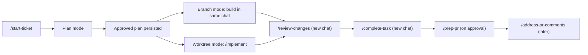

# Ticket Workflow (phase map)

This file is a **read-only map**. It names the doc that owns each phase. Do not execute steps from
here; invoke the commands directly. If anything here contradicts a command or skill, that file wins.

Setup and context live in **overlay blanks** (`profile.json`, `CUSTOMIZE.md`, `environments/`,
`agents/`). Fill those once via `/start-new-project`, then `/onboard` for the machine.
Every command below then reads the profile — it does not re-interview the user for stack or repos.

## Lifecycle overview

Coworker PR review is `/peer-review` — not on this author path.

## Phase owners

| Phase | What triggers it | Command / skill that owns the mechanics |
|---|---|---|
| Intake + classify | `/start-ticket` | [start-ticket/SKILL.md](../start-ticket/SKILL.md) → [ticket-router/SKILL.md](../ticket-router/SKILL.md) |
| Branch / worktree setup | Step 5 of start-ticket | `branch-setup` via [subagent-functions.md](../../_shared/subagent-functions.md). A spike (`investigate`) skips this row. |
| Plan (Engineering Decisions + Work Plan) | Step 6 of start-ticket (plan mode) | [bug-fix.md](../start-ticket/references/bug-fix.md) · [feature-plan.md](../start-ticket/references/feature-plan.md) · [tech-spike.md](../start-ticket/references/tech-spike.md) |
| Spike investigate | `/start-ticket <ticket> spike` (`mode: investigate`) | Read-only on the canonical clones; no branch. Closeout skips verify and review ([complete-task playbook](../complete-task/playbooks/complete-task.md)); [document-spike/SKILL.md](../document-spike/SKILL.md) only when the user asks. |
| Spike investigate | `/start-ticket <ticket> spike` (`mode: investigate`) | Read-only on the canonical clones; no branch. Closeout skips verify and review ([complete-task playbook](../complete-task/playbooks/complete-task.md)); [document-spike/SKILL.md](../document-spike/SKILL.md) only when the user asks. |
| Build (branch mode) | After plan approval | Same chat; [implement/playbooks/implement.md](../implement/playbooks/implement.md) steps 3–6 |
| Build (worktree / resume) | `/implement` | [implement/SKILL.md](../implement/SKILL.md) → [implement/playbooks/implement.md](../implement/playbooks/implement.md) |
| Local stack | `/start-stack` | [start-stack/SKILL.md](../start-stack/SKILL.md); rails: [runtime-verify.md](../../_shared/runtime-verify.md) |
| Review | `/review-changes` (new chat) | [review-changes/SKILL.md](../review-changes/SKILL.md) → [review-changes/playbooks/review-changes.md](../review-changes/playbooks/review-changes.md) |
| Closeout | `/complete-task` (new chat) | [complete-task/SKILL.md](../complete-task/SKILL.md) → [complete-task/playbooks/complete-task.md](../complete-task/playbooks/complete-task.md) |
| PR / tracker write-back | `/prep-pr` (after approval) | [prep-pr/SKILL.md](../prep-pr/SKILL.md) → [prep-pr/playbooks/prep-pr.md](../prep-pr/playbooks/prep-pr.md) |
| PR feedback | `/address-pr-comments` | [address-pr-comments/SKILL.md](../address-pr-comments/SKILL.md) → [address-pr-comments/playbooks/address-pr-comments.md](../address-pr-comments/playbooks/address-pr-comments.md) |
| Coworker PR review | `/peer-review` | [peer-review/SKILL.md](../peer-review/SKILL.md) → [peer-review/playbooks/peer-review.md](../peer-review/playbooks/peer-review.md) |
| Fresh-chat hydrate | First step of implement, review-changes, complete-task, address-pr-comments | [ticket-context-load/SKILL.md](../ticket-context-load/SKILL.md) |
| New product | `/start-new-project` | [start-new-project/SKILL.md](../start-new-project/SKILL.md) |
| New clone / machine | `/onboard` | [onboard/SKILL.md](../onboard/SKILL.md) + [CUSTOMIZE.md](../../CUSTOMIZE.md) |

## Contracts that override prose

| Question | Authoritative source |
|---|---|
| Which files each phase must produce | [_shared/ticket-artifacts.md](../../_shared/ticket-artifacts.md) |
| Chat output caps | [_shared/severity-and-output.md](../../_shared/severity-and-output.md) |
| Plan structure and Deviations | [_shared/ticket-plan-output.md](../../_shared/ticket-plan-output.md) |
| Engineering Decisions shape | [_shared/engineering-decisions.md](../../_shared/engineering-decisions.md) |
| Cross-repo order | [_shared/cross-repo-workflow.md](../../_shared/cross-repo-workflow.md) |
